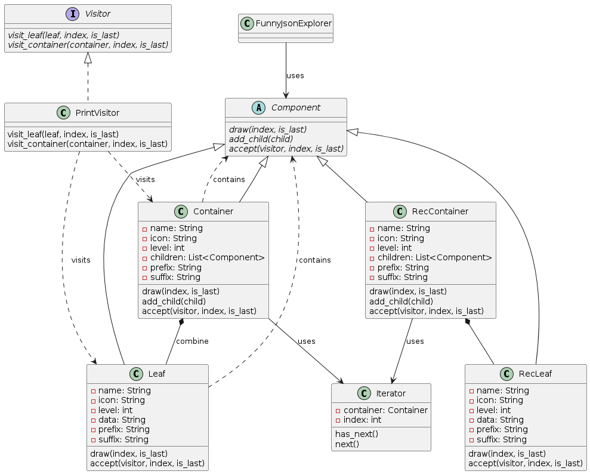
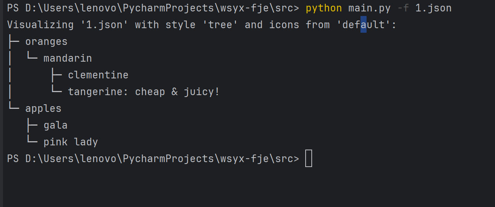
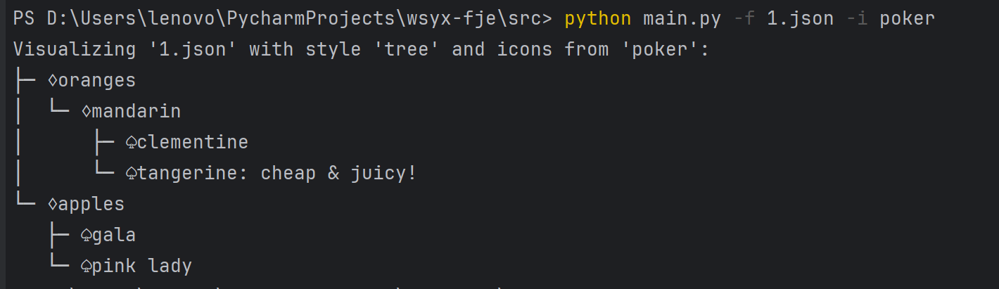
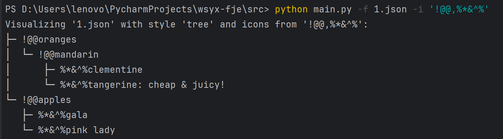
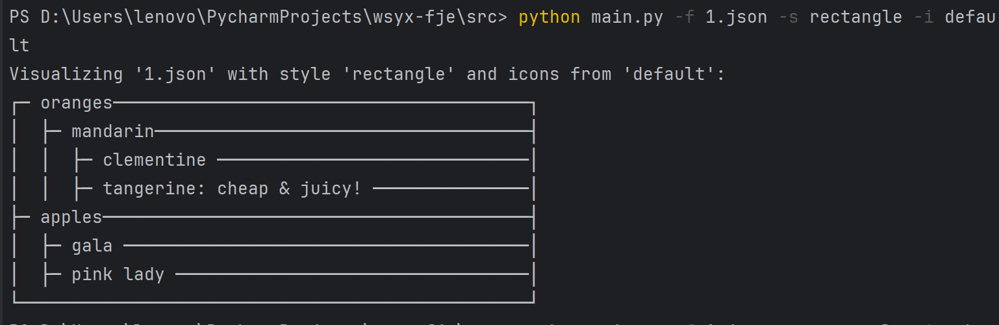
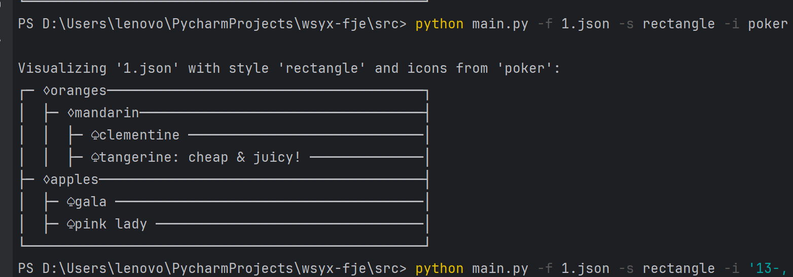
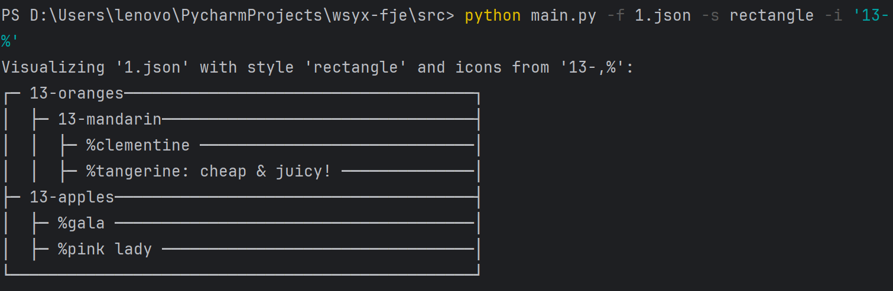

## Funny JSON Explorer（**FJE**），是一个JSON文件可视化的命令行界面小工具
> 此为使用迭代器+访问者模式reconstruct版本

结果存放：/res1文件夹
代码存放：/src文件夹
UML类图：UML1.png

实现语言：python(3.11), 无其他外部库

执行方法：在src目录下运行 `python main.py -f <json file> -s <style> -i <icon family>` 

### UML类图
图中简化了TreeFactory和RectangleFactory,已经在上一实验中展开了

### 结果截图

##### tree style+default icon (no icon)

##### tree style+poker icon

##### tree style+自定义 icon

> 写着玩新增功能，语法为-i "中间icon,叶icon"

##### rectangle style + default icon(no icon)

##### rectangle style + poker

##### rectangle style + diy icon

### 新增代码文件

- fje.py
  - build_tree只负责树的container结构构建并记录层级信息
  - show调用printVisitor的访问者实例访问并打印树，使用accept接口遍历
- iterator.py
  - 定义了迭代器，实现判断是否迭代完成和迭代功能
  - 迭代container
- visitor.py
  - 定义了visitor基类和两个分别用于访问叶子和container结点的函数
  - 实例化visitor为负责print的访问者print_visitor
- container.py
   - component接口
      - 提供add_child、draw功能接口
      - draw功能负责按格式构造输出的前缀和后缀，不再负责打印
      - accept函数作为迭代器的接口，传递树的位置信息，
   - accept
     - 访问者访问叶/container的接口
     - 使用迭代器迭代访问

### 设计模式分析

#### 迭代器模式：
##### Iterator类作用
- 封装了遍历的逻辑，使得visitor不需要知道container内部结构，通过 has_next()和 next()方法就能够访问容器的子元素

#### 访问者模式：
- PrintVisitor 类实现了 Visitor 接口
- 定义了访问 Leaf 和 Container 对象的方法，在不修改元素类的情况下，能够方便地引入新的操作
- 能够根据元素类型的不同执行不同的操作。 

在Container中，使用迭代器来遍历所有树，并对每个子元素调用其 accept 方法，使得访问者能够访问整个对象结构并区分开容器和叶子节点。

#### 优点
- 扩展性：如果需要添加新的操作，只需增加新的访问者类，无需修改Component。
- 数据管理和操作逻辑明确分开，符合单一职责原则。
- 迭代器提供了一种标准的方法来遍历容器中的元素，不受容器内部结构的影响。

