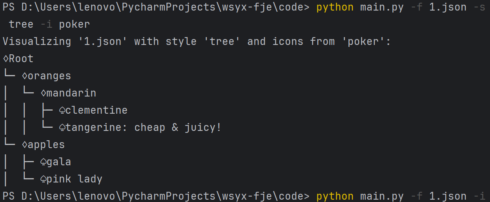

### UML类图

### 结果截图

##### tree style+default icon (no icon)

##### tree style+poker icon

##### tree style+自定义 icon

> 写着玩新增功能，语法为-i "中间icon,叶icon"

##### rectangle style + default icon(no icon)

##### rectangle style + poker

##### rectangle style + diy icon

### code文件结构

- main.py
   - 命令行指令处理函数
   - 主函数
      - 按指令创建树形/矩形树
   - 执行入口
- FunnyJsonExplorer.py
   - load指令
   - build_tree递归创建树
   - 调用根的draw()作为绘图入口
- factory.py
   - 抽象工厂
      - 解析icon
      - 创建container，leaf函数
   - TreeFactory/RectangleFactory
      - 继承抽象工厂创建树形/矩形树，实现工厂模式
- leaf.py
   - component接口
      - 提供add_child和draw功能接口
   - leaf/RecLeaf类
      - 树形/矩形叶子结点，实现了叶子的draw
   - container/recontainer类
      - 容器类，包含容器/叶，负责容器的draw

### 设计模式分析

##### 工厂模式
主要通过具体工厂类（如TreeFactory和RectangleFactory）实现，用于创建具体的Leaf和Container对象

- 优点：
   -  封装了对象的创建过程
   -  需要改变对象的创建逻辑或者添加新的对象类型时，只需修改或扩展工厂，提高了代码的可维护性。  

##### 抽象工厂模式
TreeFactory和RectangleFactory都是AbstractFactory这一抽象工厂的实现。通过定义一个包含多个工厂方法的接口（AbstractFactory），允许创建一系列相关或依赖的对象，而无需指定它们具体的类。  

- 优点：
   -  因为具体工厂类都实现自同一个接口， 方便客户端更换工厂
   -  确保了一次只能使用来自同一产品族的对象，保证一致性

##### 组合模式
Container由Leaf对象或其他Container对象组合而成。形成了树形结构

- 优点：
   - 保证组合对象调用上的一致性，减少代码量
   - 灵活组织树的结构，方便新组件的设计

##### 建造者模式

